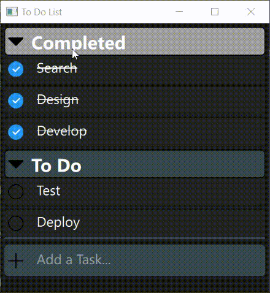

# To Do 

This is a To Do app to handle completed and to be completed tasks 

The app is developed using **QT/QML** and **C++** and support cross platform

## Demo



## Requirements
- Qt6
- cmake
- MSVC (install microsoft visual studio)
- C++17

## Build

You can build the app from the source using the following commands in your terminal:

```shell
git clone https://github.com/AhmedMoamen360/To_Do_List.git
```

```shell
cmake . -B build
```

```shell
cmake --build build --config Release -j
```

Go to build/bin/Release/ and run To_Do_List.exe

## Usage

- You can add a task with the text input then press enter
- You can delete a task by selecting it (click on the task) then press **Delete** key
- You can unselect a task by another click
- You can edit a task by double click on it then press enter
- You can switch between completed and to do tasks by pressing on the icon on the left